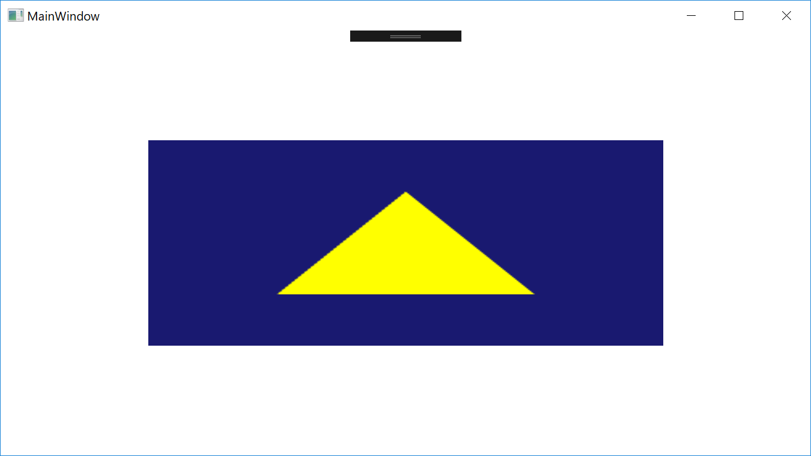

# D3DWPFExample

This is an Example of hosting D3D rendering content in WPF application.
It is useful when making Editor for Game Engine.

How To Run:

- Build D3DDLL to generate dll.
- Run D3DWPFExample for HwndHost.
- Run D3DUserControlExample for WindowsFormsHost.

